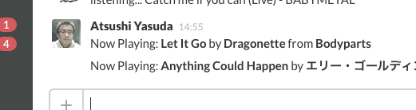
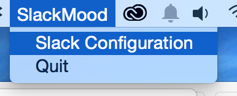
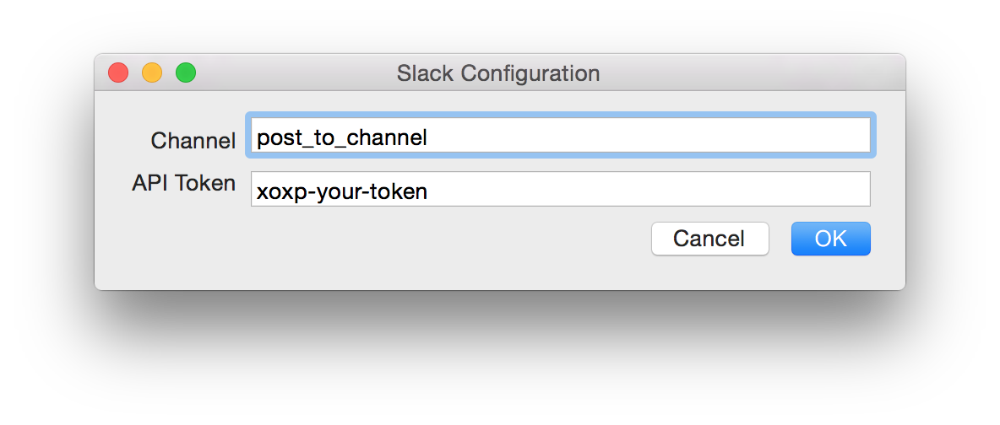

SlackMood - Post What Listen on iTunes & AppleMusic to Slack
==

How to compile
---

install xcode

setup cocoa pods

> $ cd /path/to/SlackMood

> $ sudo gem install cocoapods

> $ pod install

build SlackMood

> $ open SlackMood.xcworkspace

open configure window. SlackMood is running on your status bar.

edit api key & channel.
You can find your api token [here](https://api.slack.com/web#authentication).

and, play MUSIC!!
